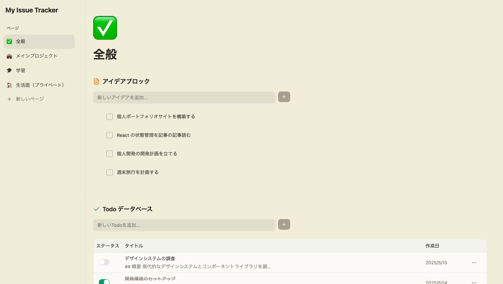
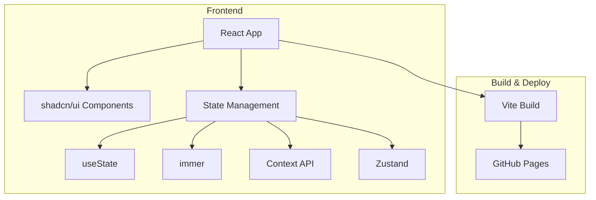
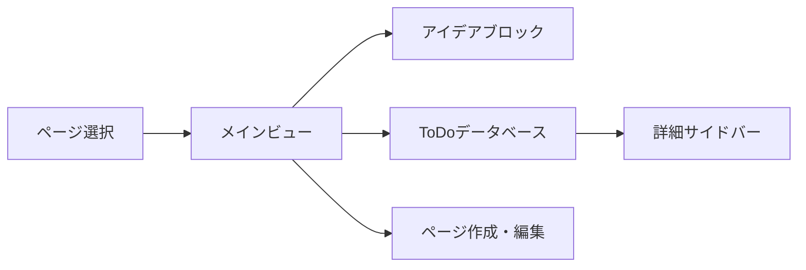

# 📝 Notion 風イシュー管理アプリ

<!-- OGイメージ -->



## 🌐 サービス URL

**デモサイト**: https://tk20211228.github.io/my-issue-tracker/
**リポジトリ**: https://github.com/your-username/my-issue-tracker

## 📝 サービス概要

### どういうアプリなのか

- **一行説明**: Notion 風 UI でアイデアと ToDo を柔軟に管理できる学習向けイシュー管理アプリ
- **解決する課題**: 状態管理ライブラリの特徴を実践的に学習しながら、実用的なアプリを構築
- **対象ユーザー**: React 状態管理を学習したい開発者、個人のタスク管理ユーザー

### 開発背景

- React 状態管理の段階的学習（useState → immer → Context API → Zustand）
- 複雑な状態構造の管理における各ライブラリの特徴と利点の理解
- 実践的なアプリケーション開発を通じた学習効果の向上

### どのように使えるのか

1. **アイデア管理**: ブロック形式でアイデアを追加・並び替え・削除
2. **ToDo 管理**: データベースビューでタスクを一覧表示・編集
3. **詳細編集**: 右サイドバーで ToDo の詳細情報を編集
4. **ページ管理**: 複数ページでプロジェクトを分けて管理

## 🛠️ 技術スタックと選定理由

### フロントエンド

| カテゴリ           | 技術                           | 選定理由                                 |
| ------------------ | ------------------------------ | ---------------------------------------- |
| **フレームワーク** | React 18 + TypeScript          | 型安全性とモダンな React 機能の活用      |
| **ビルドツール**   | Vite                           | 高速な開発体験、HMR 対応                 |
| **UI/CSS**         | Tailwind CSS + shadcn/ui       | デザインシステムの統一、開発スピード向上 |
| **状態管理**       | useState/immer/Context/Zustand | 段階的学習による比較と理解深化           |
| **スタイリング**   | Tailwind CSS                   | ユーティリティファースト、カスタマイズ性 |

### 状態管理の学習段階

| 段階        | 技術        | 学習目的                         |
| ----------- | ----------- | -------------------------------- |
| **Stage 1** | useState    | React 基本の状態管理理解         |
| **Stage 2** | immer       | イミュータブルな状態更新の簡略化 |
| **Stage 3** | Context API | グローバル状態管理の基礎         |
| **Stage 4** | Zustand     | ハイパフォーマンスな状態管理     |

### インフラ・デプロイ

| カテゴリ         | 技術           | 選定理由                       |
| ---------------- | -------------- | ------------------------------ |
| **ホスティング** | GitHub Pages   | 無料、簡単デプロイ、学習に最適 |
| **CI/CD**        | GitHub Actions | 自動デプロイ、継続的統合       |

## 🏗️ システム構成

### アーキテクチャ図



### 画面遷移図



### プロジェクト構造

```
src/
├── components/           # 再利用可能なコンポーネント
│   ├── ui/              # shadcn/ui コンポーネント
│   ├── blocks/          # アイデアブロック関連
│   ├── todo/            # ToDo管理関連
│   └── layout/          # レイアウトコンポーネント
├── hooks/               # カスタムフック
├── stores/              # 状態管理（各段階別）
│   ├── useState/        # useState実装
│   ├── immer/           # immer実装
│   ├── context/         # Context API実装
│   └── zustand/         # Zustand実装
├── types/               # TypeScript型定義
├── utils/               # ユーティリティ関数
└── lib/                 # 設定・ヘルパー
```

### データ構造

- **Pages**: ページ情報（ID、タイトル、作成日）
- **Ideas**: アイデアブロック（ID、内容、順序、ページ ID）
- **Todos**: ToDo 情報（ID、タイトル、説明、ステータス、作成日、ページ ID）
- **UI State**: サイドバー表示状態、選択中ページ等

## 🚀 環境構築

### 前提条件

- **Node.js**: 18.17 以上
- **npm**: 8.0 以上（または yarn/pnpm）
- **Git**: バージョン管理
- **VS Code**: 推奨（拡張機能設定あり）

### クイックスタート

1. **リポジトリのクローン**

```bash
git clone https://github.com/your-username/my-issue-tracker.git
cd my-issue-tracker
```

2. **依存関係のインストール**

```bash
npm install
```

3. **開発サーバーの起動**

```bash
npm run dev
```

4. **ブラウザでアクセス**

```
http://localhost:5173
```

### 開発用スクリプト

- `npm run dev`: 開発サーバー起動
- `npm run build`: 本番ビルド
- `npm run preview`: ビルド確認
- `npm run lint`: ESLint 実行
- `npm run type-check`: TypeScript 型チェック

## ✨ 主要機能と工夫した点

### 🎯 コア機能

| 機能                  | 説明                                | 工夫したポイント                   |
| --------------------- | ----------------------------------- | ---------------------------------- |
| **アイデアブロック**  | ドラッグ&ドロップ対応のブロック管理 | React DnD による直感的な操作       |
| **ToDo データベース** | テーブル形式のタスク管理            | 効率的な CRUD 操作とフィルタリング |
| **詳細サイドバー**    | リアルタイム編集機能                | 状態同期と UX 最適化               |
| **ページ管理**        | 複数プロジェクト対応                | 独立した状態管理とデータ分離       |

### 🔧 技術的なこだわり

#### 状態管理の段階的実装

- **useState**: シンプルな状態管理の基礎実装
- **immer**: 複雑な状態更新の簡略化
- **Context API**: グローバル状態の適切な設計
- **Zustand**: パフォーマンス最適化と開発体験向上

#### パフォーマンス最適化

- **メモ化**: React.memo、useMemo、useCallback の適切な使用
- **コード分割**: 動的インポートによる初期表示速度向上
- **状態最適化**: 不要な再レンダリングの防止

#### UX/UI 設計

- **レスポンシブ**: モバイルファースト設計
- **アクセシビリティ**: キーボード操作、スクリーンリーダー対応
- **デザインシステム**: shadcn/ui ベースの一貫した UI

### 🚀 パフォーマンス指標

- **初期表示**: First Contentful Paint < 1.5s
- **インタラクション**: 操作レスポンス < 100ms
- **バンドルサイズ**: gzip 圧縮後 < 200KB

## 📋 開発ガイドライン

### 学習アプローチ

1. **Stage 1 (useState)**: 基本的な状態管理の実装
2. **Stage 2 (immer)**: イミュータブル更新の導入
3. **Stage 3 (Context)**: グローバル状態管理への移行
4. **Stage 4 (Zustand)**: 最終的な最適化実装

### コーディング規約

- **TypeScript**: Strict Mode 有効化
- **ESLint + Prettier**: コード品質と統一フォーマット
- **コンポーネント設計**: 単一責任原則、再利用性重視
- **カスタムフック**: ロジックの分離と再利用

### テスト戦略

- **単体テスト**: 重要なユーティリティ関数
- **コンポーネントテスト**: 主要コンポーネントの動作確認
- **E2E テスト**: ユーザーストーリーベースのシナリオテスト

## 🚀 デプロイメント

### GitHub Pages 自動デプロイ

```yaml
name: Deploy to GitHub Pages
on:
  push:
    branches: [main]
jobs:
  deploy:
    runs-on: ubuntu-latest
    steps:
      - uses: actions/checkout@v4
      - uses: actions/setup-node@v4
        with:
          node-version: "18"
      - run: npm ci
      - run: npm run build
      - uses: peaceiris/actions-gh-pages@v3
        with:
          github_token: ${{ secrets.GITHUB_TOKEN }}
          publish_dir: ./dist
```

### デプロイ手順

1. GitHub リポジトリの設定で Pages 機能を有効化
2. `gh-pages`ブランチをソースに設定
3. main ブランチにプッシュで自動デプロイ

## 🔧 トラブルシューティング

### よくある問題と解決方法

| 問題                   | 原因                     | 解決方法                          |
| ---------------------- | ------------------------ | --------------------------------- |
| 開発サーバー起動エラー | Node.js バージョン不適合 | Node.js 18 以上に更新             |
| ビルドエラー           | TypeScript 型エラー      | `npm run type-check`で確認        |
| デプロイ失敗           | GitHub Pages 設定        | リポジトリ設定の Pages 項目を確認 |
| 状態管理エラー         | 状態の不整合             | Redux DevTools で状態確認         |

### 学習で困った時

- **useState 理解**: React の公式ドキュメント参照
- **immer 使用法**: 公式ガイドとサンプルコード確認
- **Context 設計**: プロバイダーパターンの理解
- **Zustand 活用**: 公式例とベストプラクティス参照

## 📚 学習リソース

### 関連ドキュメント

- [React 公式ドキュメント](https://react.dev/)
- [immer 公式ガイド](https://immerjs.github.io/immer/)
- [Zustand 公式ドキュメント](https://docs.pmnd.rs/zustand/)
- [shadcn/ui 公式サイト](https://ui.shadcn.com/)

### 学習の進め方

1. 各段階で実装 → 動作確認 → リファクタリング
2. 状態管理の違いを意識した比較学習
3. パフォーマンス測定とボトルネック分析
4. コードレビューと改善提案

---

## 💡 今後の拡張予定

- [ ] データ永続化（LocalStorage/IndexedDB）
- [ ] リアルタイム同期機能
- [ ] テーマ切り替え機能
- [ ] エクスポート/インポート機能
- [ ] PWA 対応

**Status**: 🚧 学習プロジェクト（継続開発中）
